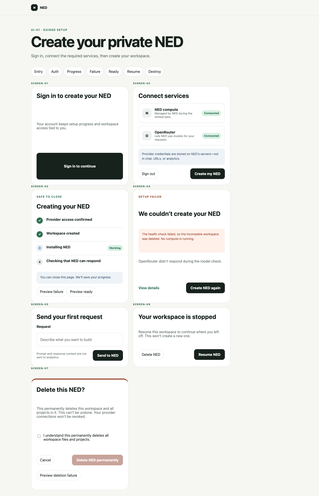
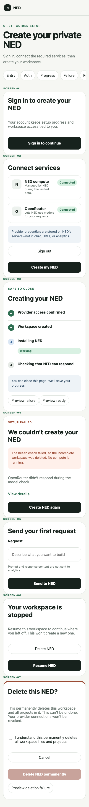
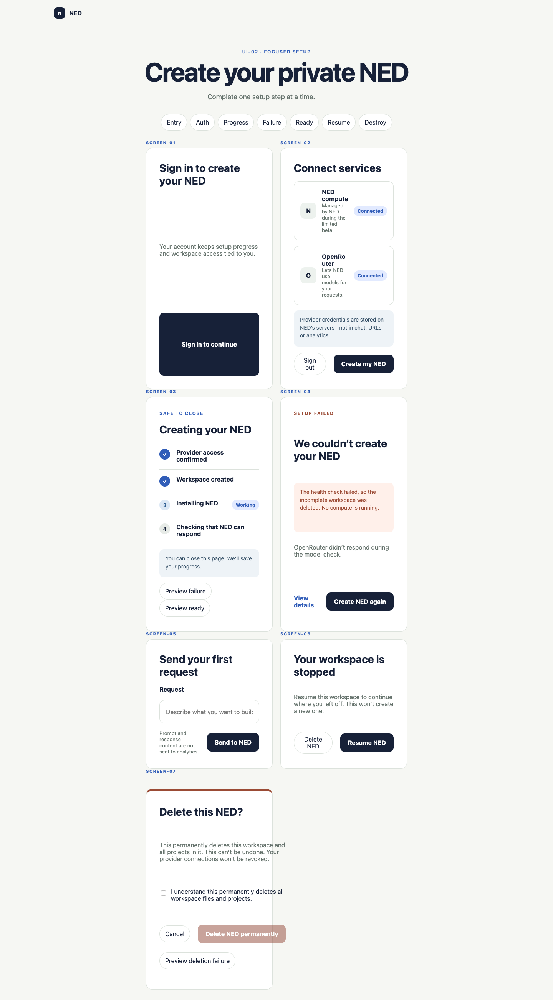
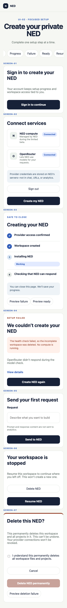
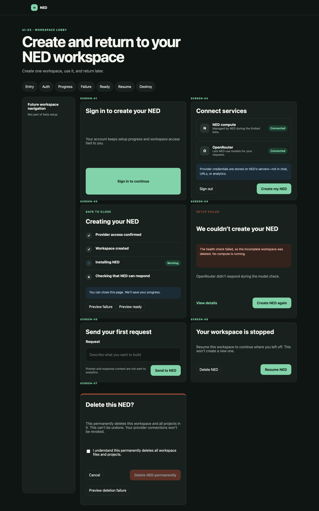
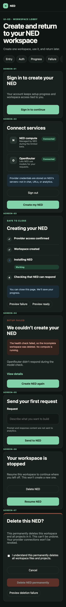

# Browser Provisioning Design Review

> **Artifact:** `docs/browser-provisioning-design/DESIGN_REVIEW.md`
> **Status:** `IN REVIEW` · `REVIEW_ONLY — DO NOT MERGE`
> **Issue:** [#23](https://github.com/DataNavAI/no-ego-dev/issues/23)
> **Review:** [draft PR #25](https://github.com/DataNavAI/no-ego-dev/pull/25)
> **Candidate:** revision 3; identity frozen by `CANDIDATE_MANIFEST.sha256`
> **Decision owner:** NED product owner
> **Decision requested:** confirm `UI-01` plus the platform-managed limited-beta working assumption.

## TL;DR

Choose **`UI-01` Guided Setup**, borrowing `UI-02`’s centered treatment only for provider redirect/return screens. It gives the primary journey enough trust context without the premature operations-console framing of `UI-03`.

Revision 3 preserves those fixes and closes the round-2 contract/lineage findings: every durable document now uses the managed-beta working assumption, **Create NED again**, and five-action count; full prior reports and a digested continuity packet are canonical.

## Decisions requested

- [ ] `DEC-01` — Confirm a **platform-managed, quota-limited beta** as the working product model. User-owned Daytona OAuth remains a production option only if Daytona supports a third-party delegated grant.
- [ ] `DEC-02` — Select `UI-01`; optionally use `UI-02`’s centered provider-return card. Reject `UI-03` for beta setup.
- [ ] `DEC-03` — Confirm five product-visible actions to first value: sign in, connect NED compute, connect OpenRouter, create, send first request.
- [ ] `DEC-04` — Confirm deleting NED removes workspace/projects but leaves provider grants active for explicit separate revocation.
- [ ] `COPY-01` — Approve the direction of the credential-storage language, subject to architecture and legal/security validation before production.

## Product and trust contract

- No local CLI, Node.js, package manager, or infrastructure knowledge.
- No raw Daytona API-key form.
- One account, one idempotent provisioning intent, and one workspace in the MVP.
- Provider credentials never appear in chat, URLs, or analytics; exact storage and scope language remains architecture/legal gated.
- Progress, cleanup, deletion, and cost claims must be driven by backend evidence.
- Activation is a passing remote health check; primary journey completion is the first successful browser request.

## Comparison

| Variant | CUJ fit | Trust/hierarchy | Mobile | Cost | Disposition |
| --- | --- | --- | --- | --- | --- |
| `UI-01` Guided Setup | Excellent | Best balance | Clear single column | Medium | **Recommended** |
| `UI-02` Focused Setup | Strong | Strong focus, less continuity | Clear single column | Low–medium | Borrow provider-return treatment only |
| `UI-03` Workspace Lobby | Over-scoped before first value | Operational framing competes with setup | Rail collapses correctly | High | Reject for beta; retain as future reference |

## `UI-01` — Recommended

**Runnable:** [`prototype/guided.html`](prototype/guided.html)
**Storyboard:** [`prototype/guided.html?state=storyboard`](prototype/guided.html?state=storyboard)

### `UI-01-DESKTOP`



### `UI-01-MOBILE`



## `UI-02` — Focused comparison

**Runnable:** [`prototype/focused.html`](prototype/focused.html)

### `UI-02-DESKTOP`



### `UI-02-MOBILE`



## `UI-03` — Future lifecycle reference, rejected for beta setup

**Runnable:** [`prototype/lobby.html`](prototype/lobby.html)

### `UI-03-DESKTOP`



### `UI-03-MOBILE`



## Screen contract

| ID | Primary job | Revision-2 behavior |
| --- | --- | --- |
| `SCREEN-01` | Establish identity | **Sign in to continue** is the one primary action. |
| `SCREEN-02` | Connect services | NED compute and OpenRouter connect independently; create remains disabled until both connect. |
| `SCREEN-03` | Show resumable progress | Verified stages, no fake percentage/duration, safe-to-close message. |
| `SCREEN-04` | Recover after failed create | Deleted workspace leads to **Create NED again**, not health-check retry. |
| `SCREEN-05` | Complete first value | Empty composer → working → completed response; no answer appears before send. |
| `SCREEN-06` | Return to the same workspace | **Resume NED** explicitly avoids duplicate workspace creation. |
| `SCREEN-07` | Stop future cost | Delete is disabled until acknowledgement; pending, failure-preview, and completion states exist. |

## Stable hotspots

| ID | Component | Contract |
| --- | --- | --- |
| `A1` | Connect NED compute | Enroll/check the platform-managed limited beta; no user API key. |
| `A2` | Connect OpenRouter | Server-mediated OAuth PKCE; independent cancel/deny/retry in production. |
| `A3` | Sign in | Creates/binds the product session before provider authorization. |
| `A5` | Create my NED | One idempotent intent; disabled until required services are connected. |
| `A6` | Create NED again | Reuses the intent after verified cleanup; does not health-check a deleted workspace. |
| `A7/A8` | Request/send | Labeled input; duplicate send disabled; pending/success/failure supported. |
| `A9` | Resume NED | Restores the same stopped workspace. |
| `A10/A11` | Acknowledge/delete | Destructive action gated; remote deletion is awaited before verified completion. |

## Revision 1 review disposition

| Finding | Disposition | Revision-2 evidence |
| --- | --- | --- |
| Mixed compute ownership | Accepted | UI now shows platform-managed limited beta only; `DEC-01` requests confirmation. |
| Missing identity | Accepted | `SCREEN-01` and `A3`. |
| Cleanup/retry contradiction | Accepted | `SCREEN-04` uses **Create NED again**. |
| Fake first success | Accepted | Runtime empty → working → completed transition. |
| Ungated deletion | Accepted | Delete disabled until checkbox; pending/success/failure-preview states. |
| Unsupported time/cost language | Accepted | Durations and idle-cost claims removed. |
| Focus/target/320px failures | Accepted | Runtime verification covers focus, ≥44px controls, and no overflow at 320/390/1440. |
| Missing review contract/lineage | Accepted | Frozen `UI_REVIEW_GUIDELINE.md` and `CANDIDATE_MANIFEST.sha256`. |

Full round-1 dispositions: [`reviews/round-1-copy.md`](reviews/round-1-copy.md), [`reviews/round-1-ui.md`](reviews/round-1-ui.md).

Round-2 reports and complete continuity: [`reviews/round-2-copy-full.md`](reviews/round-2-copy-full.md), [`reviews/round-2-ui-full.md`](reviews/round-2-ui-full.md), and [`REVIEW_CONTINUITY.md`](REVIEW_CONTINUITY.md).

## Verification

From the repository root, serve the prototypes:

```bash
python3 -m http.server 4173 --bind 127.0.0.1 --directory docs/browser-provisioning-design/prototype
```

Then run with temporary Playwright tooling outside the repository:

```bash
NODE_PATH=/tmp/ned-issue23-capture/node_modules node docs/browser-provisioning-design/verify.cjs
NODE_PATH=/tmp/ned-issue23-capture/node_modules node docs/browser-provisioning-design/capture.cjs
```

Verified revision 2:

- all variants: no document overflow at 320×844, 390×844, or 1440×900;
- visible controls ≥44px;
- route focus moves to destination headings;
- create is gated on two independent connections;
- no response appears before send; pending and success execute;
- delete is gated by acknowledgement; pending and success execute;
- six captures contain seven screens each with no horizontal page overflow;
- `npm test`: 39/39; `npm run check`: pass; prototype JS syntax: pass.

## Open production risks

- `RISK-01` — Platform-managed beta needs quota, abuse, cost, eligibility, and support policies.
- `RISK-02` — Daytona third-party delegated OAuth remains unverified; do not promise it.
- `RISK-03` — Identity provider and account recovery are not selected.
- `RISK-04` — Backend state machine must prove cleanup/deletion claims and cross-tenant isolation.
- `RISK-05` — Security/legal review must approve final credential, scope, billing, and deletion copy.

## REVIEW_ONLY lifecycle

- **PR mode:** `REVIEW_ONLY`; never merge this temporary branch/PR.
- Accepted decisions will move to canonical feature PRD/design/spec artifacts on a separate mergeable branch.
- Cleanup owner: parent NED agent.
- Cleanup trigger: explicit approved, abandoned, or superseded outcome after accepted work is preserved.
- Cleanup inventory: exact review PR/branch/worktree and `/tmp/ned-issue23-capture/`.

## Feedback disposition log

| Thread | Review ID | Disposition | Revision | Status |
| --- | --- | --- | --- | --- |
| Awaiting human review | `DEC-01` | needs decision | revision 2 | open |
| Awaiting human review | `DEC-02` | needs decision | revision 2 | open |
